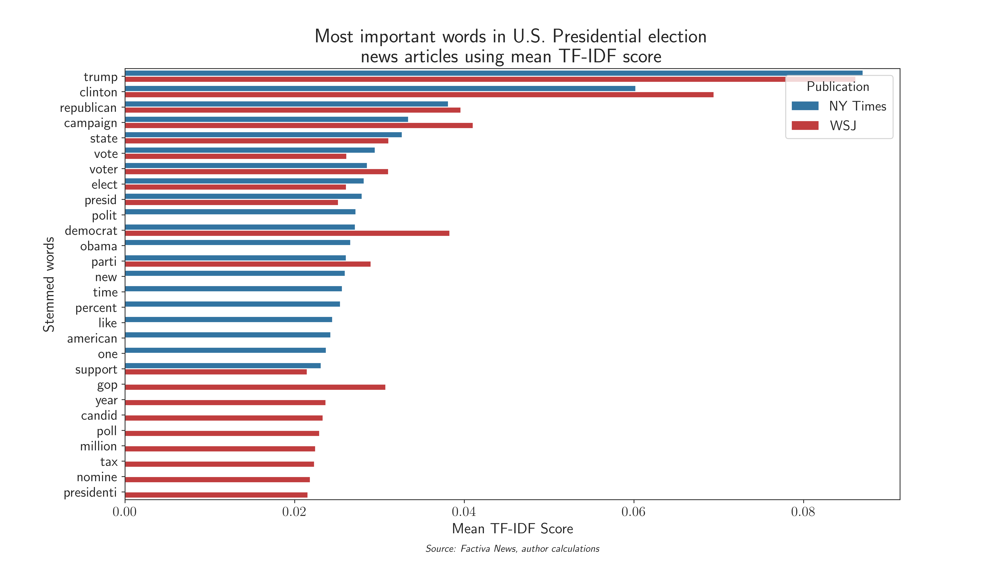
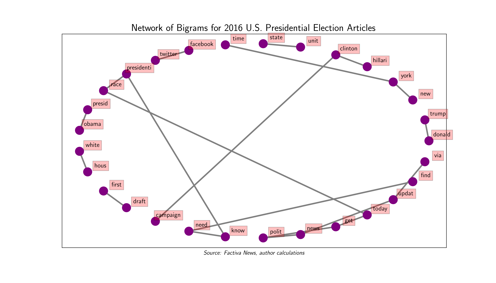

```{r setup, include=FALSE}
knitr::opts_chunk$set(echo = TRUE)
knitr::opts_chunk$set(message = FALSE)
library(pacman)
p_load(tidyverse)
p_load(reticulate)
p_load(htmltools)
p_load(sf)
p_load(arules)
p_load(arulesViz)
p_load(shiny)
py_run_string("import os as os")
py_run_string("os.environ['QT_QPA_PLATFORM_PLUGIN_PATH'] = 'C:/Users/Monke/anaconda3/Library/plugins/platforms'")
```


```{r, include = FALSE}
# data processing can be found in process_map_data.R

list_dfs <- list()
list_dfs[['Presidential']] <- readRDS('data/president_map.rds')
list_dfs[['U.S. Senate']] <- readRDS('data/senate_map.rds')
list_dfs[['Local-level']] <- readRDS('data/local_map.rds')
list_dfs[['U.S. House']] <- readRDS('data/house_map.rds')
list_dfs[['State-level']] <- readRDS('data/state_map.rds')

list_dfs[['combined']] <- list_dfs[['Presidential']] %>% 
  left_join(list_dfs[['U.S. House']] %>% select(FIPS,d_house_ratio = d_ratio,r_house_ratio = r_ratio)) %>%
  left_join(list_dfs[['U.S. Senate']] %>% select(FIPS,d_senate_ratio = d_ratio,r_senate_ratio = r_ratio)) %>%
  left_join(list_dfs[['Local-level']] %>% select(FIPS,d_local_ratio = d_ratio,r_local_ratio = r_ratio)) %>%
  left_join(list_dfs[['State-level']] %>% select(FIPS,d_state_ratio = d_ratio,r_state_ratio = r_ratio)) %>%
  mutate(diff_prez_house_d_ratio = d_ratio - d_house_ratio) %>%
  mutate(diff_prez_senate_d_ratio = d_ratio - d_senate_ratio) %>%
  mutate(diff_prez_local_d_ratio = d_ratio - d_local_ratio) %>%
  mutate(diff_prez_state_d_ratio = d_ratio - d_state_ratio)

# geo map
countymap <- suppressMessages(st_read(dsn = "data/shape_files", 
                     layer = "tl_2019_us_county", quiet = TRUE) %>%
  st_transform(crs = 2163))

# ACS data
acsdata <- readRDS('data/acs_fips_annual_data.rds')

# add presidential data to acs
acs_prez_data <- acsdata %>% 
  inner_join(list_dfs[['Presidential']]) %>% 
  filter(YEAR <= 2016) %>%
  mutate(dem_vote = ifelse(d_ratio > r_ratio, TRUE, FALSE)) %>% 
  ungroup()
```

About
================================

### Analytical objectives:

The 2016 election was one of the most polarizing in our Nation's history. There is a multitude of data available to help us understand the landscape of the 2016 election and why voters made the decision to back Donald Trump. The first section "A Polarized Nation", highlights demographic and economic variables that distinguish Democratic and Republican counties. While Republican counties tend to have lower income than Democratic ones, they also have lower levels of poverty. White proportion of the population is a strong indicator of county outcome. The next section "News of the 2016 Presidential Election" examines the textual output of liberal leaning The New York Times and the conservative leaning Wall Street Journal (WSJ) during June to November 2016 using sentiment analysis, TF-IDF scoring, and bigram analysis. There are distinct differences between the publications. The third section "2016 Split-Ticket Voting" shows choropleths of all levels of elections that occurred in 2016, as well as the vote difference between Presidential and all other elections. Western Wisconsin supports Democratic House candidates while also leaning Republican in the Presidential race. Local elections in the south that had data were consistently more Republican than those counties' Presidential votes. And in the final section "County Factors in 2016 Outcome", association rules mining is used as a correlative method to determine demographics that commonly lead to Democratic or Republican winners in counties. This brings the narrative full circle as many of the demographics considered in the first section are strongly associated with polarized outcomes. 

### Data sources and software:

#### Election data

Zip files were downloaded from the following sites. The data files were already in a neat csv format. 

* [Local precinct-level data 2016](https://dataverse.harvard.edu/dataset.xhtml?persistentId=doi:10.7910/DVN/Q8OHRS)
* [State precinct-level data 2016](https://dataverse.harvard.edu/dataset.xhtml?persistentId=doi:10.7910/DVN/GSZG1O)
* [US House precinct-level data 2016](https://dataverse.harvard.edu/dataset.xhtml?persistentId=doi:10.7910/DVN/PSKDUJ)
* [US Senate precinct-level data 2016](https://dataverse.harvard.edu/dataset.xhtml?persistentId=doi:10.7910/DVN/NLTQAD)
* [President precinct-level data 2016](https://dataverse.harvard.edu/dataset.xhtml?persistentId=doi:10.7910/DVN/LYWX3D)

Data processing included the following:
  
  * aggregating vote totals to county-level
  * Creating Democratic/Republican vote percentages

#### ACS data

Data was downloaded from IPUMS using their interactive data puller. The time period for the data is 2005-2016 as those are the years that provide county FIPS codes. The following variables were used:

Data was aggregated up to the county-level using weighted statistics according to the `person weight` variable.

ACS data from IPUMS USA, University of Minnesota, www.ipums.org

#### News data

Data was downloaded from Factiva in 100 article chunks. The search parameters were as follows:

* text search: election AND (trump OR clinton)
* date range: 06-01-2016 to 11-08-2016
* Source: The New York Times OR The Wall Street Journal

3,013 results were found, and the raw data was downloaded in rtf format and converted to raw text using the striprtf package in Python. This data is then cleaned, tokenized, stemmed, and stop words removed using nltk. Sentiment is calculated using nltk VADER sentiment. TF-IDF analysis is performed using the nltk package. Tensorflow is used to perform bi-directional LSTM neural network analysis to predict news publication based on cleaned tokenized text. 

#### Software versions:

##### R packages

* tidyverse==1.3.0
* sf=0.9.6
* reticulate==1.16
* rmarkdown==2.4.6
* flexdashboard==0.5.2
* ggplot2==3.3.2
* pacman==0.5.1

##### Python packages

* python==3.8.5
* striprtf==0.0.12
* pandas==1.0.5
* numpy==1.18.5
* dateutil==2.8.1
* seaborn==0.11.0
* matplotlib==3.2.2
* nltk==3.5
* plotly==4.10.0
* re==2.2.1
* sklearn==0.23.1
* tensorflow==2.3.1


A Polarized Nation
==============================

Columns
-------------------------------------

### Poverty rates

```{r, echo = FALSE, fig.width = 12}
ggplot(acs_prez_data, 
       aes(x = YEAR, y = poverty_rate, color = dem_vote)) + 
  # lines partially transparent, one line per county FIPS code
  geom_line(aes(group = FIPS), alpha = 0.15) + 
  
  # median lines
  geom_line(data = acs_prez_data %>% 
              group_by(YEAR, dem_vote) %>% 
              summarize(poverty_rate = median(poverty_rate)),
  size = 1.5) +
  # custom color scheme
  scale_color_manual(labels = c("Republican","Democrat"), 
                     values = c('red','steelblue')) +
  # plot labels
  labs(y = "Poverty Rate",
       x = "Year",
       title = "Spaghetti plot of U.S. county\npoverty rates over time",
       subtitle = "Democratic counties experienced greater levels of poverty\nrelative to the rates of Republican counties",
       caption = 'Data: ACS, MIT Election Lab, author calculations',
       color = '2016 Presidential\nVote Winner\n(Median line highlighted)') +
  # custom theme settings
  scale_x_continuous(expand=c(0,0)) + # make graph not have extra space on x
  scale_y_continuous(expand=c(0,0), # make graph not have extra space on y
                     sec.axis = dup_axis(name = NULL)) + # duplicate axis without title
  theme(panel.background = element_blank(), # remove panel background
        axis.text = element_text(size = 10),
        axis.title = element_text(size = 12),
        axis.line = element_line(color="black", size = 0.3),
        plot.title = element_text(hjust = 0.5, size = 14),
        plot.subtitle = element_text(size = 10),
        plot.caption = element_text(hjust = 0),
        legend.title = element_text(size = 12))
```

### Racial and income differences

```{r, echo = FALSE, fig.width = 12}
ggplot(acs_prez_data %>% filter(YEAR == 2016), 
       aes(x = avg_white, y = avg_income, color = dem_vote)) + 
  # average line for income
    geom_hline(data = acs_prez_data %>% 
               filter(YEAR == 2016) %>% 
               group_by(dem_vote) %>% 
               summarize(avg_income = mean(avg_income),
                         avg_white = mean(avg_white)),
             aes(yintercept = avg_income, color = dem_vote),
             linetype = 'dotted', size = 1
             ) +
  # average line for white proportion
    geom_vline(data = acs_prez_data %>% 
               filter(YEAR == 2016) %>% 
               group_by(dem_vote) %>% 
               summarize(avg_income = mean(avg_income),
                         avg_white = mean(avg_white)),
             aes(xintercept = avg_white, color = dem_vote),
             linetype = 'dotted', size = 1
             ) +
  # points
    geom_point(alpha = 0.7) +
  # custom color scheme
  scale_color_manual(labels = c("Republican","Democrat"), 
                     values = c('red','steelblue')) +
  # plot labels
  labs(y = "Average Income ($)",
       x = "White Population Proportion",
       title = "U.S. counties racial and income relationship in 2016",
       subtitle = "Democratic counties are significantly\nmore diverse and have higher average incomes",
       caption = 'Data: ACS, MIT Election Lab, author calculations',
       color = '2016 Presidential\nVote Winner\n(Mean dotted lines)') +
  # custom theme settings
  scale_y_continuous(sec.axis = dup_axis(name = NULL)) + # duplicate axis without title
  theme(panel.background = element_blank(), # remove panel background
        axis.text = element_text(size = 10),
        axis.title = element_text(size = 12),
        axis.line = element_line(color="black", size = 0.3),
        plot.title = element_text(hjust = 0.5, size = 14),
        plot.subtitle = element_text(size = 10),
        plot.caption = element_text(hjust = 0),
        legend.title = element_text(size = 12))
```


Column {data-width=600} {.tabset .tabset-fade}
-------------------------------------


### Hispanic population

```{r, echo = FALSE, fig.width = 8}
ggplot(acs_prez_data %>% filter(YEAR == 2016), 
       aes(x = dem_vote, y = avg_hispanic, color = dem_vote)) + 
  # violin
  geom_violin() +
  # overlay boxplot
  geom_boxplot(width=0.1) +
  # custom color scheme
  scale_color_manual(labels = c("Republican","Democrat"), 
                     values = c('red','steelblue')) +
  
  # plot labels
  labs(y = "Hispanic Population Proportion",
       x = "2016 Presidential Vote Winner",
       title = "Distribution of Hispanic population\nin U.S. counties split by 2016 Presidential winner",
       subtitle = "Greater proportion Hispanic counties tend to\nlean Democratic though not across the board",
       caption = 'Data: ACS, MIT Election Lab, author calculations',
       color = '2016 Presidential\nVote Winner') +
  # custom theme settings
  scale_x_discrete(breaks = c(FALSE,TRUE), labels = c('Republican','Democrat')) + # make x labels clear
  scale_y_continuous(sec.axis = dup_axis(name = NULL)) + # duplicate axis without title
  theme(panel.background = element_blank(), # remove panel background
        axis.text = element_text(size = 10),
        axis.title = element_text(size = 12),
        axis.line = element_line(color="black", size = 0.3),
        plot.title = element_text(hjust = 0.5, size = 14),
        plot.subtitle = element_text(size = 10),
        plot.caption = element_text(hjust = 0),
        legend.title = element_text(size = 12))
```

### Veteran distribution

```{r, echo = FALSE, fig.width = 8}
ggplot(acs_prez_data %>% filter(YEAR == 2016), 
       aes(x = dem_vote, y = vet_rate, color = dem_vote)) + 
  # violin
  geom_violin() +
  # overlay boxplot
  geom_boxplot(width=0.3) +
  # custom color scheme
  scale_color_manual(labels = c("Republican","Democrat"), 
                     values = c('red','steelblue')) +
  # plot labels
  labs(y = "Veteran Population Proportion",
       x = "2016 Presidential Vote Winner",
       title = "Veteran population distribution in U.S. counties\nsplit by 2016 Presidential winner",
       subtitle = "Clear veteran preference for Republicans",
       caption = 'Data: ACS, MIT Election Lab, author calculations',
       color = '2016 Presidential\nVote Winner') +
  # custom theme settings
  scale_x_discrete(breaks = c(FALSE,TRUE), labels = c('Republican','Democrat')) + # make x labels clear
  scale_y_continuous(sec.axis = dup_axis(name = NULL)) + # duplicate axis without title
  theme(panel.background = element_blank(), # remove panel background
        axis.text = element_text(size = 10),
        axis.title = element_text(size = 12),
        axis.line = element_line(color="black", size = 0.3),
        plot.title = element_text(hjust = 0.5, size = 14),
        plot.subtitle = element_text(size = 10),
        plot.caption = element_text(hjust = 0),
        legend.title = element_text(size = 12))

```

### Medicare vote

```{r, echo = FALSE, fig.width = 8}
ggplot(acs_prez_data %>% filter(YEAR == 2016), 
       aes(x = d_ratio, y = avg_medicare)) + 
  geom_point(aes(color = dem_vote)) + 
  geom_smooth(color = 'black', method = 'lm') +
  # custom color scheme
  scale_color_manual(labels = c("Republican","Democrat"), 
                     values = c('red','steelblue')) +
  # plot labels
  labs(y = "Proportion of Medicare enrollees",
       x = "2016 Presidential Democratic Vote Percentage",
       title = "Scatterplot of Democratic vote and Medicare proportion by U.S. counties",
       subtitle = "More Democratic areas tend to have fewer Medicare enrollees",
       caption = 'Data: ACS, MIT Election Lab, author calculations',
       color = '2016 Presidential\nVote Winner') +
  # custom theme settings
  scale_y_continuous(sec.axis = dup_axis(name = NULL)) + # duplicate axis without title
  theme(panel.background = element_blank(), # remove panel background
        axis.text = element_text(size = 10),
        axis.title = element_text(size = 12),
        axis.line = element_line(color="black", size = 0.3),
        plot.title = element_text(hjust = 0.5, size = 14),
        plot.subtitle = element_text(size = 10),
        plot.caption = element_text(hjust = 0),
        legend.title = element_text(size = 12))

```


News of the 2016 Presidential Election
=================================

Column  {data-width=500}
---------------------------

### Negative Sentiment Timeline --- if graph is cut off, zoom out in browser

```{r, echo = FALSE, out.width = "30%"}
# created in python_news_processing.ipynb
htmltools::includeHTML("img/plotly_negsentiment.html")
```

### Positive Sentiment Timeline --- if graph is cut off, zoom out in browser

```{r, echo = FALSE, out.width = "30%"}
# created in python_news_processing.ipynb
htmltools::includeHTML("img/plotly_possentiment.html")
```


Column {data-width=500}
---------------------------

### TFIDF Analysis

```{python, echo = FALSE, eval = FALSE}
from matplotlib import rc
import matplotlib.pyplot as plt
import pandas as pd
# see python processing script python_news_processing.ipynb
top_tfidf = pd.read_csv('data/tfidf.csv')
rc('text', usetex=True)
fig = plt.figure(figsize=(14,8))
sns.set_palette([sns.color_palette()[0],sns.color_palette()[3]])
with sns.axes_style("ticks"):
    sns.barplot(data = top_tfidf, x = 'mean_tfidf', y = 'word_input', hue ='Publication')
    plt.title("Most important words in U.S. Presidential election\nnews articles using mean TF-IDF score", fontsize = 20)
    plt.ylabel('Stemmed words')
    plt.xlabel(r'\begin{center}Mean TF-IDF Score\\*\textit{\normalsize{' + 'Source: Factiva News, author calculations' + r'}}\end{center}')
    #plt.show()
    
    SMALL_SIZE = 14
    MEDIUM_SIZE = 15
    BIGGER_SIZE = 16

    plt.rc('font', size=SMALL_SIZE)          # controls default text sizes
    plt.rc('axes', titlesize=SMALL_SIZE)     # fontsize of the axes title
    plt.rc('axes', labelsize=MEDIUM_SIZE)    # fontsize of the x and y labels
    plt.rc('xtick', labelsize=SMALL_SIZE)    # fontsize of the tick labels
    plt.rc('ytick', labelsize=SMALL_SIZE)    # fontsize of the tick labels
    plt.rc('legend', fontsize=SMALL_SIZE)    # legend fontsize
    plt.rc('figure', titlesize=BIGGER_SIZE)  # fontsize of the figure title
    
    fig.show()
    #fig.savefig('img/tfidf.png', dpi = 600)
```

```{r tfidf, echo = F, out.width = '100%'}

```

### Bigram Analysis

```{r bigrams, echo = F, out.width = '100%'}

```


2016 Split-Ticket Voting
==============================

```{r, include = FALSE}

map_func <- function(level){
  
  plot_data <- list_dfs[[level]] %>% full_join(countymap, by = c('FIPS' = 'GEOID'))

  plot_title <- paste('Choropleth of 2016 county-level',level,'\nelection Democratic vote percentage')
  legend_title <- 'Democratic\nvote percentage'
  
  ggplot(data = plot_data) + 
    geom_sf(aes(geometry = geometry, 
                 fill = d_ratio), 
                 color = NA) +
    
    coord_sf(crs = st_crs(2163),
             xlim = c(-2200000, 2500000), 
             ylim = c(-2300000, 730000)) +
    
    # labels
    labs(title = plot_title,
         caption = 'Source: MIT Election Lab, author calculations') +
    
    
    # legend title
    scale_fill_distiller(palette = "Spectral", 
                         direction = 1,
                         name = legend_title) + 
    
    # theme remove plot background
    theme(panel.background = element_blank(),
          plot.title = element_text(hjust=0.5),
          legend.title = element_text(size = 8),
          axis.text=element_blank(),
          axis.ticks=element_blank())
}
```
Column {.tabset}
---------------------

### Presidential Election

```{r, echo = FALSE}
map_func('Presidential')
```

### U.S. Senate Election

```{r, echo = FALSE}
map_func('U.S. Senate')
```

### U.S. House Election

```{r, echo = FALSE}
map_func('U.S. House')
```


### State-level Election

```{r, echo = FALSE}
map_func('State-level')
```

### Local-level Election

```{r, echo = FALSE}
map_func('Local-level')
```

```{r, include = FALSE}


diff_map_func <- function(level, varname, title, other){
  
  plot_data <- list_dfs[[level]] %>% full_join(countymap, by = c('FIPS' = 'GEOID'))

  #plot_title <- paste('Choropleth of county-level',level,'election\nDemocratic vote percentage')
  legend_title <- paste0('2016 Democratic vote difference\n(President - ',other,')')
  
  ggplot(data = plot_data) + 
    geom_sf(aes_string(geometry = 'geometry', 
                 fill = varname), 
                 color = NA) +
    
    coord_sf(crs = st_crs(2163),
             xlim = c(-2200000, 2500000), 
             ylim = c(-2300000, 730000)) +
    
    # plot title
    labs(title = title,
         caption = 'Source: MIT Election Lab, author calculations') +
    
    # legend title
    scale_fill_distiller(palette = "Spectral", 
                         direction = 1,
                         name = legend_title) + 
    
    # theme remove plot background
    theme(panel.background = element_blank(),
          plot.title = element_text(hjust=0.5),
          legend.title = element_text(size = 8),
          axis.text=element_blank(),
          axis.ticks=element_blank())
}
```

Column {.tabset}
-------------------------------------

### President vs U.S. House

```{r, echo = FALSE}
diff_map_func('combined', 
              'diff_prez_house_d_ratio', 
              "Choropleth of county-level differences between\nPresidential election and U.S. house election",
              'U.S. House')
```

### President vs U.S. Senate

```{r, echo = FALSE}
diff_map_func('combined', 'diff_prez_senate_d_ratio', 
              "Choropleth of county-level differences between\nPresidential election and U.S. senate election",
              'U.S. Senate')
```

### President vs State

```{r, echo = FALSE}
diff_map_func('combined', 'diff_prez_state_d_ratio', 
              "Choropleth of county-level differences between\nPresidential election and state-level election",
              'State-level')
```

### President vs Local

```{r, echo = FALSE}
diff_map_func('combined', 'diff_prez_local_d_ratio', 
              "Choropleth of county-level differences between\nPresidential election and local-level election",
              'Local-level')
```

County Factors in 2016 Outcome
==============================

Column {data-width=150}
-------------------------------------

### Introduction

Association rules are a method for showing IF-THEN correlations. This network graphs shows ACS demographic variables and rules that are correlated with U.S. counties picking the Democratic or Republican candidate in the 2016 election. Shading of the rules indicates the degree of dependence among the variables for that rule. Hover your mouse over the rules for statistics about the rule. Hover over any node to see its direct connections.

For background on the metrics, [read here](https://en.wikipedia.org/wiki/Association_rule_learning)

Column {data-width=850}
-------------------------------------

### Interactive decision rules output

```{r, echo = FALSE, message = FALSE, warning = FALSE}
network_data <- acs_prez_data %>% filter(YEAR == 2016) %>%  
  mutate(dem_vote = ifelse(as.factor(dem_vote) == TRUE, "Democrat","Republican")) %>% 
  select('Avg. household income' = avg_hhincome, 
         'Avg. age' = avg_age, 
         'White pop. prop.' = avg_white, 
         'Hispanic pop. prop.' = avg_hispanic, 
         'Health insurance coverage prop.' = avg_hlthinsur, 
         'Medicare prop.' = avg_medicare, 
         'Avg. individual income' = avg_income, 
         'Avg. investment income' = avg_invincome, 
         'Poverty rate' = poverty_rate, 
         '200% of poverty rate' = poverty200_rate, 
         'Extreme poverty rate' = povertyX_rate, 
         'Veteran proportion' = vet_rate, 
         'Average commute time' = avg_transit, 
         'Proportion renting' = rent_perc, 
         'Avg. rent' = avg_rent, 
         "'16 Pres. Winner" = dem_vote)

#ruleExplorer(network_data, parameter = list(supp = 0.18, conf = 0.1, target = "rules"))

rules <- apriori(network_data, 
                                  parameter = list(supp = 0.18, conf = 0.1, target = "rules"), 
                          control = list(verbose = FALSE))

rules_sub <- subset(rules, subset=rhs %in% c("'16 Pres. Winner=Republican","'16 Pres. Winner=Democrat"))

plot(rules_sub, 
     method = "graph", 
     engine = 'htmlwidget', 
     control = list(verbose = FALSE), max = 20)
```


